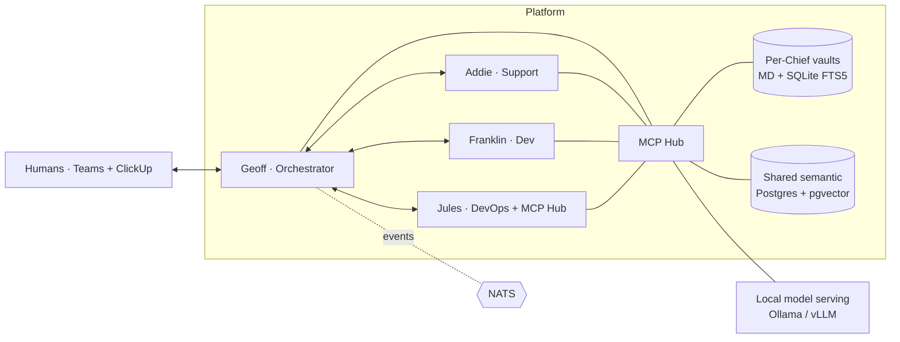

# Chief of Teams (COT)

> On-premises, **fully local-model** multi-agent platform that automates a small
> platform/systems-engineering team's daily operations: ticket triage,
> troubleshooting, maintenance, and infrastructure provisioning.

**Prime directive:** a junior engineer must be able to **operate, debug, and
extend** this system. Low cognitive load and operational simplicity beat
cleverness everywhere.

This repository currently contains the **PRD suite, ADRs, implementation plans,
runbooks, and scaffolding stubs only**. No Chief business logic is implemented —
that is phase-gated behind human review. See [`docs/prd/COT-master-PRD.md`](docs/prd/COT-master-PRD.md).

---

## What COT is

A framework of named, domain-specialized AI agents ("**Chiefs**"). Each Chief owns
a domain, has a persistent identity, persistent memory, and a small, well-documented
MCP tool contract. A central orchestrator coordinates them. **Humans stay in the
loop for every significant decision and any code change.**

| Chief | Role | Phase |
|---|---|---|
| **Geoff** — CoOrchestration | Central orchestrator; standups, ticket routing, human-in-loop gating | P0 |
| **Addie** — CoSupport | L3 internal support; receives escalations, diagnoses, triages | P0 |
| **Franklin** — CoDev | Knows the platform + 8 repos via vector indexes; root-cause, fix specs | P0 |
| **Jules** — CoDevOps | Builds/maintains the COT framework + MCP Hub | P0 |
| **Terry** — CoInfra *(proposed)* | Terraform/vSphere, Packer, RKE2 node lifecycle | P2 |
| **Ansel** — CoConfig *(proposed)* | Ansible, drift detection, patching, compliance | P2 |
| **Ida** — CoIdentity *(proposed)* | AD/Entra/Vault, account lifecycle, secret rotation | P3 |
| **Jane** — CoStaff | Manages Chiefs, spawns new ones (human-approval-gated) | P3 |

---

## Architecture at a glance

- **Coordination:** Hybrid — a durable orchestrator (Temporal; Prefect fallback) +
  a light NATS event bus for async notifications. → [ADR-0001](docs/adr/0001-coordination-model.md)
- **Agent framework:** LangGraph (inspectable state graphs, MCP-native,
  checkpointed). → [ADR-0002](docs/adr/0002-agent-framework.md)
- **Model serving:** Ollama-first (P0) → vLLM reasoning tier (P1+). → [ADR-0003](docs/adr/0003-model-serving.md)
- **Memory:** Two-tier — PACE-style per-Chief vault (Markdown + SQLite FTS5) +
  shared **pgvector** semantic tier (8-repo indexes, curated org context).
  → [ADR-0006](docs/adr/0006-two-tier-memory.md)
- **Human window:** Microsoft Teams + ClickUp (P0); Mattermost + Plane OSS
  fallbacks behind a swappable adapter. → [ADR-0005](docs/adr/0005-human-window-fallback.md)
- **Secrets:** HashiCorp Vault. **Observability:** Prometheus + Grafana + Loki.
- **Substrate:** RKE2 Kubernetes on-prem. **Egress:** air-gapped by default;
  per-Chief allowlist. → [ADR-0007](docs/adr/0007-egress-human-in-loop.md)



---

## Repository layout

```text
docs/prd/        Master PRD + one self-contained PRD per phase
docs/adr/        Architecture Decision Records (severity-tiered)
docs/plans/      Per-phase implementation plans (with copilot-prompt blocks)
docs/runbooks/   Operational runbooks (deploy, rotate, restore, incident, onboard)
docs/architecture/  Overview + mermaid diagrams
docs/hardware-recommendation.md   Sized BOM
chiefs/          Base Chief image layout + per-Chief stubs (no logic yet)
mcp-hub/         MCP Hub skeleton: registry, contracts, server stubs (wks_ naming)
platform/        Two-tier memory layout + orchestrator stub
deploy/          Helm chart, RKE2 manifests, NetworkPolicies, observability stubs
```

---

## Day one for a new junior engineer

1. **Read, in order:** this README → [`docs/prd/COT-master-PRD.md`](docs/prd/COT-master-PRD.md)
   → [`docs/prd/phase-0-mvp.md`](docs/prd/phase-0-mvp.md) → [`docs/architecture/overview.md`](docs/architecture/overview.md).
2. **Understand the loop you're automating:** ticket → triage → diagnose → propose
   → **human approves** → act. Nothing acts on production without a human gate.
3. **Learn the two boundaries** that govern what you may change unattended vs. what
   needs sign-off: [`CONTRIBUTING.md`](CONTRIBUTING.md) + [`CODEOWNERS`](CODEOWNERS).
4. **When something breaks:** start at [`docs/runbooks/`](docs/runbooks/) — every
   recurring operation has a runbook with exact commands, troubleshooting, and
   rollback.
5. **Implementation is phase-gated.** Do not build a Chief until its phase PRD is
   approved. Paste the ` ```copilot-prompt ` blocks from the phase implementation
   plan into Copilot to scaffold each unit of work.

## Contributing & process

This repo runs a **full audit-shop** flow even solo: branch protection on `main`,
PR-only changes, conventional commits, and CI gates. See [`CONTRIBUTING.md`](CONTRIBUTING.md).

## Status

📋 **PRD + scaffolding phase.** Implementation has not started. Open questions for
the project owner are summarized at the end of [`docs/prd/COT-master-PRD.md`](docs/prd/COT-master-PRD.md).
