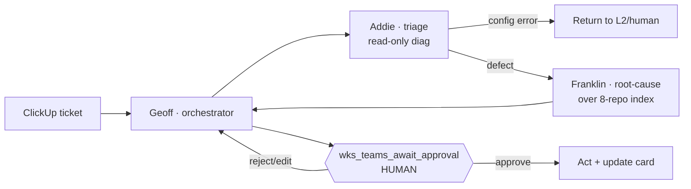
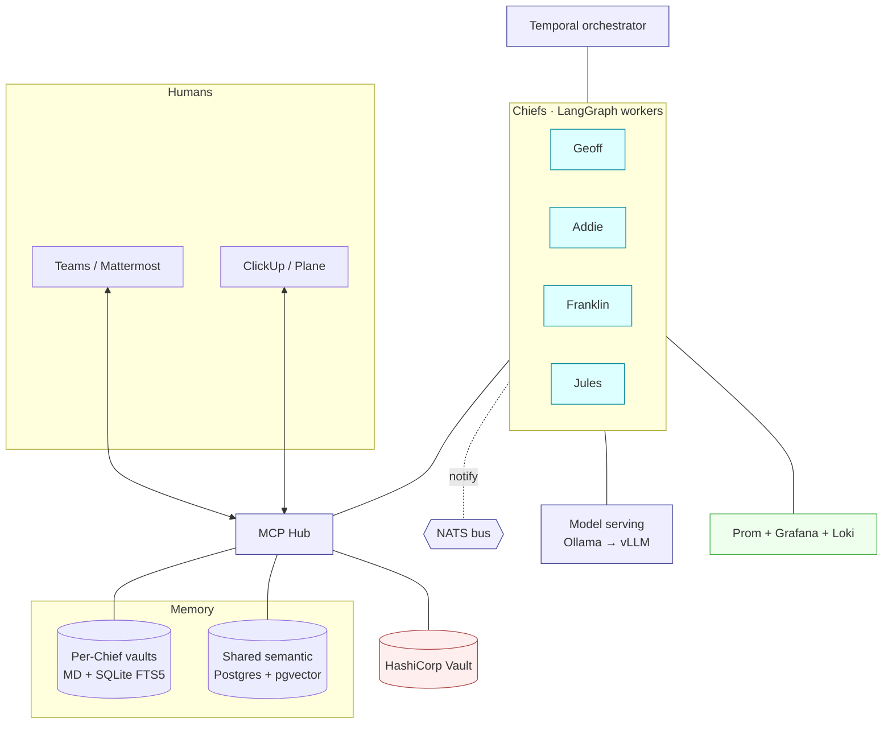

# Architecture overview

A single-page mental model of COT. For the "why" behind each choice, follow the ADR
links; for build detail, the phase PRDs and plans.

## The loop (what COT does)

## Components

## Key invariants (never violate)

1. **Human gate:** every production-affecting action funnels through
   `wks_teams_await_approval`. Timeouts never auto-approve. ([ADR-0007](../adr/0007-egress-human-in-loop.md))
2. **Air-gapped by default:** default-deny egress; per-component allowlist only, each
   justified in the egress matrix.
3. **Local-only reasoning:** no model inference leaves the premises.
4. **Two-tier memory:** private per-Chief vaults (FTS5) stay siloed; shared semantic
   recall is read-by-all, write-gated. ([ADR-0006](../adr/0006-two-tier-memory.md))
5. **Restart-recoverable:** durable workflow state means single instances are fine at
   90–95% uptime.
6. **Junior-operable:** every recurring operation has a runbook; every workflow has a
   visual trace.

## Map: decision → ADR → where it lives

| Concern | ADR | Code/stub |
|---|---|---|
| Coordination | [0001](../adr/0001-coordination-model.md) | [`platform/orchestrator/`](../../platform/orchestrator/README.md) |
| Agent framework | [0002](../adr/0002-agent-framework.md) | [`chiefs/_base/`](../../chiefs/_base/README.md) |
| Model serving | [0003](../adr/0003-model-serving.md) | [`deploy/helm/cot/values.yaml`](../../deploy/helm/cot/values.yaml) |
| Shared store | [0004](../adr/0004-shared-semantic-store.md) | [`platform/memory/shared/`](../../platform/memory/shared/schema.sql) |
| Human window | [0005](../adr/0005-human-window-fallback.md) | [`mcp-hub/servers/`](../../mcp-hub/servers/) |
| Two-tier memory | [0006](../adr/0006-two-tier-memory.md) | [`platform/memory/`](../../platform/memory/per-chief/README.md) |
| Egress + gates | [0007](../adr/0007-egress-human-in-loop.md) | [`deploy/k8s/network-policies/`](../../deploy/k8s/network-policies/README.md) |

Standalone diagram sources: [`diagrams/`](diagrams/).
