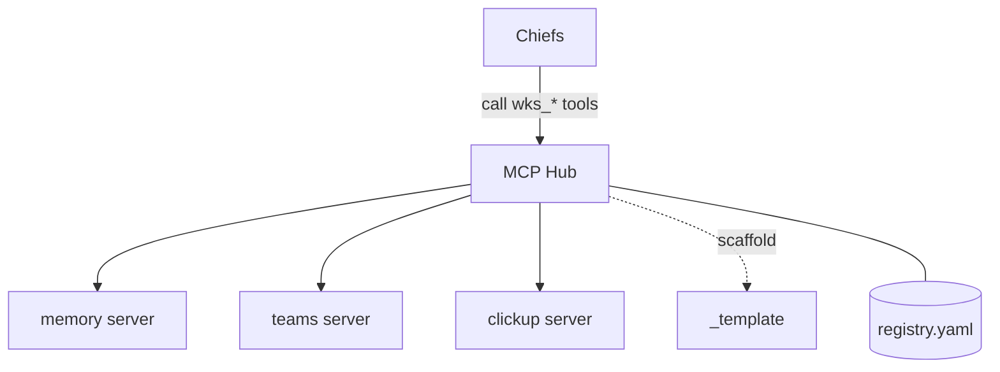

# MCP Hub

The single place Chiefs discover and call tools. Jules owns it. **Skeleton only.**

- **`registry/registry.yaml`** — declarative catalog of MCP servers and the tools
  they expose. Source of truth for "what tools exist and who may use them".
- **`contracts/`** — one Markdown spec per tool (name, inputs, outputs, side effects,
  gate, egress). Naming: **`wks_` + snake_case**.
- **`servers/`** — one directory per MCP server (stubs). Add a new one by copying
  `_template/` (`wks_hub_scaffold`), writing the contract, then **human-gated**
  registration into `registry.yaml`.

## Guardrails

- A tool is callable by a Chief only if `registry.yaml` grants it.
- Any tool with **egress** needs an architect-approved entry in the egress matrix
  (`docs/prd/COT-master-PRD.md` → Security). Default is `egress: none`.
- Action tools (anything that mutates production) declare a `gate: human`.

Operate it: [`docs/runbooks/mcp-hub-ops.md`](../docs/runbooks/mcp-hub-ops.md).
